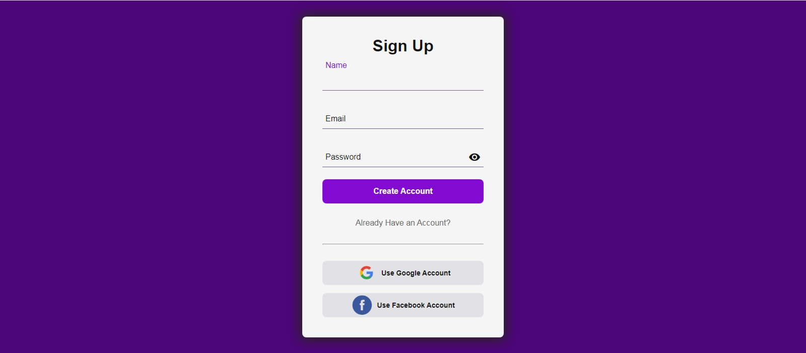

<h1 align="center"> Login Page </h1>

Programa gratuito,  apresentado como aula no canal Senhor Programador no Youtube.  

  <a href="#-tecnologias">Tecnologias</a>&nbsp;&nbsp;&nbsp;|&nbsp;&nbsp;&nbsp;
  <a href="#-projeto">Projeto</a>&nbsp;&nbsp;&nbsp;|&nbsp;&nbsp;&nbsp;
  <a href="#-layout">Layout</a>&nbsp;&nbsp;&nbsp;|&nbsp;&nbsp;&nbsp;
  <a href="#memo-licença">Licença</a>

 

  

## 🚀 Tecnologias

Esse projeto foi desenvolvido com as seguintes tecnologias:

- HTML e CSS
- JavaScript
- Git e Github
- Google Icons

## 💻 Projeto

O Login Page é um exemplo de tela de Login de uso geral

## 🔖 Layout

Projeto executado como estudo acompanhando o vídeo no Youtube do canal Senhor Programador, com algumas altarações promovidas por mim.

## 📝 Licença

Livre, esse projeto executado no canal do Youtube Senhor Programador e modificado por mim.

---

Feito com ♥ by Wellington Sato 👋 